# 🦞 Claw Home - 小龙虾 RPG 状态面板

<p align="center">
  
</p>

<p align="center">
  <strong>QQ宠物风格的小龙虾实时状态可视化面板</strong>
</p>

<p align="center">
  <a href="#功能特性">功能特性</a> •
  <a href="#在线体验">在线体验</a> •
  <a href="#快速开始">快速开始</a> •
  <a href="#技术栈">技术栈</a> •
  <a href="#API文档">API文档</a>
</p>

---

## ✨ 功能特性

### 🎮 游戏化界面
- **QQ宠物/QQ农场风格** - 可爱温馨的游戏化UI设计
- **实时动画效果** - 眨眼、摇摆、气泡、发光等CSS动画
- **响应式设计** - 完美适配桌面和移动端

### 🦞 小龙虾状态系统
支持6种状态实时显示，让你一眼就知道小龙虾在干嘛：

| 状态 | 图标 | 描述 | 触发场景 |
|------|------|------|----------|
| 休息 😴 | 💤 | 小龙虾在睡觉充电 | 空闲时段 |
| 干活 💪 | 🔨 | 小龙虾正在努力工作 | 执行任务时 |
| 同步 🔄 | ☁️ | 小龙虾在同步数据 | 备份/同步数据 |
| 修复Bug 🐛 | 🔧 | 小龙虾在苦逼修Bug | 修复错误时 |
| 思考 🤔 | 💭 | 小龙虾在深度思考 | 分析/推理时 |
| 学习 📚 | 📖 | 小龙虾在学习新技能 | 学习/训练时 |

### ☀️🌙 昼夜模式
- **日间模式** (6:00-18:00): 明亮海洋背景 + 金色太阳
- **夜间模式** (18:00-6:00): 深蓝星空背景 + 发光月亮 + 闪烁星星
- **一键切换** - 顶部按钮快速切换
- **自动切换** - 根据时间自动切换

### 👥 多龙虾支持
- **主龙虾** - 显示你的主要AI助手状态
- **子Agent龙虾** - 显示运行中的子agent状态
- **独立状态** - 每只龙虾有自己的状态和任务

### 💬 互动功能
| 互动 | 图标 | 效果 |
|------|------|------|
| 喂食 | 🍤 | 恢复能量 +10% |
| 玩耍 | 🎾 | 消耗能量 -5%，提升心情 |
| 抚摸 | 👋 | 提升心情 |
| 查看 | 🔍 | 显示系统信息 |

**快捷键**: `1`喂食 `2`玩耍 `3`抚摸 `4`查看

### 📊 实时数据面板
- **能量条** - 显示小龙虾当前能量状态
- **心情** - 显示小龙虾的心情状态
- **技能数** - 显示已掌握技能数量
- **运行时间** - 显示本次会话运行时长
- **任务追踪** - 最近任务列表和完成状态
- **今日统计** - 今日释放空间、完成任务、对话轮次

---

## 🌐 在线体验

### 本地运行

```bash
# 克隆仓库
git clone https://github.com/victorShawFan/claw_home.git

# 进入目录
cd claw_home

# 启动本地服务器
python3 -m http.server 8080

# 打开浏览器访问
open http://localhost:8080
```

### 一键启动脚本

```bash
# Linux/Mac
./start.sh

# Windows
start.bat
```

---

## 🚀 快速开始

### 1. 基础使用

打开页面后，你可以：
- **查看状态** - 观察主小龙虾的状态和气泡对话
- **点击互动** - 点击小龙虾或底部按钮进行互动
- **切换昼夜** - 点击顶部 ☀️/🌙 按钮切换模式
- **查看任务** - 右侧面板查看最近任务和统计

### 2. 对接 OpenClaw（进阶）

通过 WebSocket 或 JavaScript API 对接 OpenClaw：

```javascript
// 设置小龙虾状态
window.ClawHomeAPI.setStatus('working');

// 添加子Agent
window.ClawHomeAPI.addSubAgent({
    id: 'agent-1',
    name: '小钳子 #1',
    status: '🟢 运行中',
    task: '搜索新技能...'
});

// 显示消息
window.ClawHomeAPI.showMessage('任务完成！✅');

// 互动
window.ClawHomeAPI.interact('pet');
```

### 3. WebSocket 实时对接

```javascript
// 连接后端
const ws = new WebSocket('ws://localhost:8080');

ws.onmessage = (event) => {
    const data = JSON.parse(event.data);
    
    switch(data.type) {
        case 'status_update':
            window.ClawHomeAPI.setStatus(data.status);
            break;
        case 'subagent_add':
            window.ClawHomeAPI.addSubAgent(data.agent);
            break;
        case 'subagent_remove':
            window.ClawHomeAPI.removeSubAgent(data.agentId);
            break;
    }
};
```

---

## 🛠️ 技术栈

| 技术 | 用途 |
|------|------|
| **HTML5** | 页面结构 |
| **CSS3** | 样式、动画、响应式布局 |
| **JavaScript (ES6+)** | 交互逻辑、状态管理 |
| **WebSocket** | 实时通信（预留接口）|
| **SVG** | 小龙虾图标 |

### 项目结构

```
claw_home/
├── index.html              # 主页面
├── css/
│   └── style.css          # 样式文件（含动画）
├── js/
│   └── app.js             # 主逻辑文件
├── assets/
│   └── lobster.svg        # 小龙虾SVG图标
├── README.md              # 项目说明
├── start.sh               # Linux/Mac 启动脚本
└── start.bat              # Windows 启动脚本
```

---

## 📖 API文档

### JavaScript API

#### `ClawHomeAPI.setStatus(stateCode)`
设置主小龙虾状态

**参数:**
- `stateCode` (string): 状态代码，可选值：`resting`, `working`, `syncing`, `fixing`, `thinking`, `learning`, `idle`

**示例:**
```javascript
window.ClawHomeAPI.setStatus('working');
```

#### `ClawHomeAPI.addSubAgent(agent)`
添加子Agent龙虾

**参数:**
- `agent` (Object): Agent信息
  - `id` (string): 唯一标识
  - `name` (string): 显示名称
  - `status` (string): 状态文本
  - `task` (string, optional): 当前任务

**示例:**
```javascript
window.ClawHomeAPI.addSubAgent({
    id: 'agent-1',
    name: '小钳子 #1',
    status: '🟢 运行中',
    task: '搜索新技能...'
});
```

#### `ClawHomeAPI.removeSubAgent(agentId)`
移除子Agent

**参数:**
- `agentId` (string): Agent ID

**示例:**
```javascript
window.ClawHomeAPI.removeSubAgent('agent-1');
```

#### `ClawHomeAPI.showMessage(message)`
显示气泡消息

**参数:**
- `message` (string): 消息内容

**示例:**
```javascript
window.ClawHomeAPI.showMessage('任务完成！✅');
```

#### `ClawHomeAPI.interact(action)`
触发互动

**参数:**
- `action` (string): 动作类型，可选值：`feed`, `play`, `pet`, `check`

**示例:**
```javascript
window.ClawHomeAPI.interact('feed');
```

---

## 🎨 自定义主题

### 修改颜色变量

在 `css/style.css` 中修改 `:root` 变量：

```css
:root {
    --primary-color: #FF6B6B;      /* 主色 */
    --secondary-color: #4ECDC4;    /* 次色 */
    --accent-color: #FFE66D;       /* 强调色 */
    --bg-color: #E8F4F8;           /* 背景色 */
    --card-bg: rgba(255, 255, 255, 0.9);  /* 卡片背景 */
    --text-dark: #2C3E50;          /* 深色文字 */
    --text-light: #7F8C8D;         /* 浅色文字 */
}
```

### 添加新状态

在 `js/app.js` 的 `LOBSTER_STATES` 中添加：

```javascript
const LOBSTER_STATES = {
    // ... 现有状态
    CUSTOM: { code: 'custom', icon: '🎨', text: '自定义', color: '#9B59B6' }
};
```

---

## 📝 更新日志

### v1.1.0 (2026-03-10)
- ✨ 添加昼夜模式切换功能
- ☀️ 日间模式：明亮海洋背景 + 太阳
- 🌙 夜间模式：深蓝星空背景 + 月亮 + 星星
- ⏰ 自动根据时间切换昼夜模式

### v1.0.0 (2026-03-10)
- 🎉 初始版本发布
- 🦞 小龙虾状态可视化
- 👥 多龙虾支持
- 💬 互动功能
- 📊 实时数据面板
- 📱 响应式设计

---

## 🤝 贡献指南

欢迎提交 Issue 和 Pull Request！

### 开发流程

1. Fork 本仓库
2. 创建特性分支 (`git checkout -b feature/AmazingFeature`)
3. 提交更改 (`git commit -m 'Add some AmazingFeature'`)
4. 推送到分支 (`git push origin feature/AmazingFeature`)
5. 打开 Pull Request

---

## 📄 许可证

[MIT](LICENSE) License

---

## 🙏 致谢

- 灵感来源于 QQ宠物、QQ农场、QQ牧场
- 感谢 OpenClaw 提供的技术支持

---

<p align="center">
  <strong>🦞 让你的AI助手可视化！</strong>
</p>

<p align="center">
  Made with ❤️ by 小龙虾
</p>
